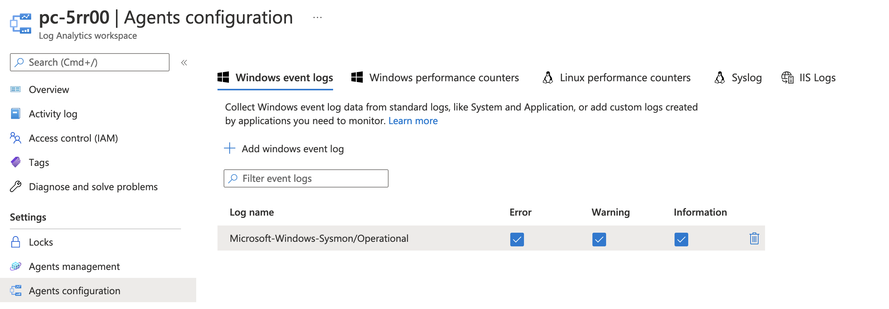
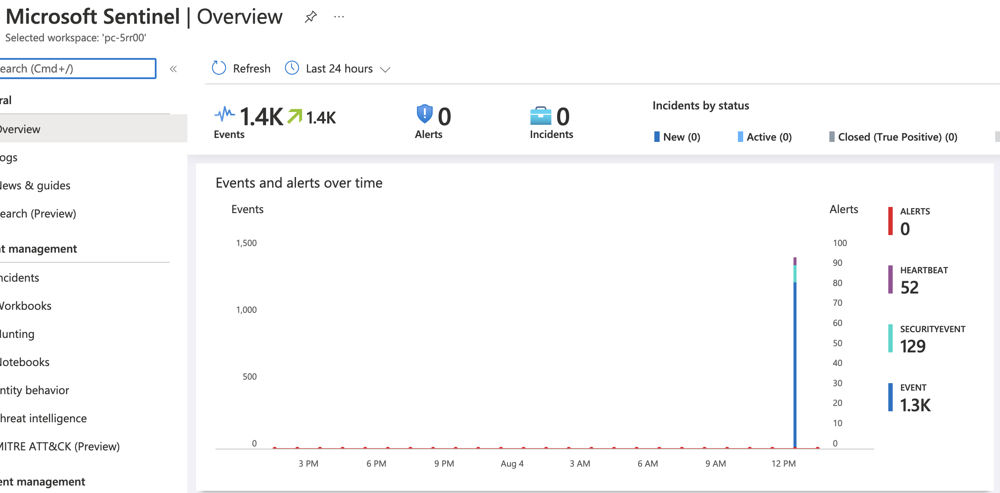

# Azure Sentinel lab

## Overview
This tool generates an Azure sentinel lab with optional Windows 10 Endpoints forwarding logs to the Sentinel Log Analytics workspace.  Optionally configure a Domain Controller with Domain Join.  Windows 10 Azure VMs automatically install and configure the legacy Microsoft Monitoring Agent (MMA) or Operations Management Suite (OMS) and send logs to the Log Analytics workspace.  The endpoints will install Sysmon by default. Note that some manual configuration steps are required for final logging configuration.   

## Manual Logging Configuration

After creating the lab there are a couple of manual setup steps required. 

### Step 1:  Add Sysmon Channel in log analytics agents configuration

Navigate into the ```log analytics workspace``` and ```agents configuration```.  Select the ```add windows event log```.  Type ```Microsoft-Windows-Sysmon/Operational``` into the Log name input field and select Apply.  The following screen shot shows how the configuration should look. 




### Step 2:  Enable the Sentinel Data Connector - "Security Events via Legacy Agent"
Navigate into Sentinel.  Find ```Data connectors``` under ```Configuration```.  In the search field or by scrolling below, find the connector named ```Security Events via Legacy Agent```.  Select ```open the connector page``` in the lower right hand corner.  Select ```Common``` under ```which events to stream``` and ```Apply changes.```  Verify that the connector shows a green highlight and shows connected, as shown below.


### Step 3:  Reboot Virtual Machines and Verify connected in Agents Management

Verify that all Windows 10 Virtual machines show as connected.  Verify this by navigating into the ```Log Analytics workspace``` and looking under ```Agents management``` under ```settings```.  Reboot each of the Azure Virtual Machines and then look to verify that they all list a connected status.  It should look like the following screen shot shown below.
  


Note: When configuring ```Domain Join``` with Active Directory, the Azure Windows 10 Professional machines will automatically reboot after joining the domain, so no manual reboot is necessary.  

After the Virtual Machines reboot, you can navigate into the Sentinel overview page and start to see new Sysmon and Windows security event logs in the Overview.  The ```Sysmon``` logs will show under ```EVENT``` table while the security event logs will show under the ```SECURITYEVENT``` table.



## Usage Examples

### Example 1:  Simple Azure Sentinel lab
 
```$ python3 sentinel.py```

This generates an Azure Sentinel lab with a Log Analytics workspace.

This generates a terraform format HCL file for ```sentinel.tf``` and ```providers.tf```.

```-l <LOCATION>```:  Specify a different location (Default: eastus)

```-odc```:  Optionally enables the Office 365 data connector for Sentinel.

```-adc```:  Optionally enables the Azure AD data connector for Sentinel.

### Example 2:  One Windows 10 Endpoint with Sysmon installed

This generates a single Windows 10 Endpoint with Sysmon installed.

```$ python3 sentinel.py --endpoint 1```

All Windows 10 Pro systems will automatically send logs to Sentinel.  Some small manual steps are required (listed above) to get Sysmon and Security logs properly working.

### Example 3: Domain Controller with Forest and Users + Windows Domain Join (Randomly Generate Users)

```$ python3 sentinel.py --domain_controller --ad_domain rtcfingroup.com --admin RTCAdmin --password MyPassword012345 --ad_users 500 --endpoints 2  --domain_join```

**Description:**

This will automatically create an Azure Sentinel deployment.  This will also create a Domain Controller in dc_sentinel.tf and install AD DS with forest name of rtcfingroup.com.  This will create a custom local administrator account and password with 500 domain users.   In this example, the domain users are randomly generated using the command line flag of ```--ad_users``` for a total of 500 users.  The domain users will be written to ad_users.csv and will have the password specified in --password.  Note that domain join is disabled by default for Windows 10 Pro but the ```domain_join``` parameter enables it for all Windows 10 Pro created.  This will also create two Windows 10 Pro terraform files (win10-1.tf, win10-2.tf) as well as a terraform file for the Domain Controller (dc_sentinel.tf).  For the two Windows 10 Pro endpoints, they will be configured with the Microsoft Monitoring Agent (MMA) to ship logs to Log Analytics Workspace with Azure Sentinel.

### Example 4: Domain Controller with Forest and Users + Windows Domain Join (Import Custom Users from CSV)

```$ python3 sentinel.py --domain_controller --ad_domain rtcfingroup.com --admin RTCAdmin --password MyPassword012345 --csv users.csv --endpoints 2  --domain_join```

**Description:**
Same capabilities as above, except it can import a custom list of Domain Users into active directory on the DC instance.  The script checks to make sure that users are in the correct format.  An example CSV showing five users is listed below:

```
name,upn,password,groups,oupath,domain_admin
Lars Borgerson,larsborgerson@rtcfingroup.com,MyPassword012345,IT,OU=IT;DC=rtcfingroup;DC=com,False
Olivia Odinsdottir,oliviaodinsdottir@rtcfingroup.com,MyPassword012345,IT,OU=IT;DC=rtcfingroup;DC=com,True
Liem Anderson,liemanderson@rtcfingroup.com,MyPassword012345,IT,OU=IT;DC=rtcfingroup;DC=com,False
John Nilsson,johnnilsson@rtcfingroup.com,MyPassword012345,IT,OU=IT;DC=rtcfingroup;DC=com,False
Jason Lindqvist,jasonlindqvist@rtcfingroup.com,MyPassword012345,IT,OU=IT;DC=rtcfingroup;DC=com,True
```

## Details

### Advanced Command Line
 
```--resource_group <rg_name>```:  Name of the Azure resource group to automatically create  (Default:  PurpleCloud)

```--location <location>```:  The Azure location to use (Default:  eastus)

```--endpoints <num_of_endpoints>```:  Number of Windows 10 Professional systems to build (Default: 0)

```--domain_controller```:  Create a Domain Controller and install AD DS with Forest (Default:  Disabled)

```--ad_domain <domain>```:  The name of the AD Domain to provision (Default:  rtc.local)

```--ad_users <num_of_domain_users>```:  The number of AD users to automatically build (Default:  Disabled)

```--csv <csv_file>```:  A custom CSV file to use that will load domain users on the DC's AD DS  (Default:  Disabled)

```--admin <admin_username>```:  The Local Administrator account (Default:  RTCAdmin)

```--password <password>```:  The local Administrator password and default AD user password (Default:  auto generate a strong password)

```--domain_join```:  Join the Windows 10 Pro systems to the AD Domain (Default:  false)

```--auto_logon```:  Automatically logon the domain user with their credentials upon system start (Default:  false)

### How AD Builds on the DC

Some notes I've gathered on AD usage and building.

* Azure AD Connect:  The Azure AD connect MSI is included in ths repo.  It can be upgraded by replacing the file in ```files/dc/AzureADConnect.msi```.  The current version is 2.x of AD Connect.  The file is uploaded to the storage container and then downloaded to the local Administrator's desktop.

* The bootstrap script for building Active Directory is contained in ```files/dc/bootstrap-dc.ps1.tpl```.  This script is used to build AD DS on the dc instance created in dc.tf.

* After terraform runs, the actual rendered dc bootstrap script (with variables) is output to ```output/dc/bootstrap-dc1.ps1.```  For troubleshooting you can copy that script to the DC and run it.

* The way AD users, groups, and OUs are added:  In the CSV file, there is a field for ```oupath```.  The string for the ```OU=``` is looked at and a new OU is created if it hasn't already.  This is the way new OUs can be added.  AD users are added to that specific OU when they are created.  For adding AD Groups, the CSV field for ```groups``` is examined.  The user is added into that AD group.  The ```groups``` and ```OU=``` portion of the oupath should match.  If they don't, problems could arise adding the user.

* The ```ad_users.csv``` file is the name of the file that the DC uses to build AD.  It is uploaded to the storage container that is created and downloaded automatically by the DC.  Look in ```C:\terraform\ad_users.csv``` to look at this file if needed.

* When using the ```--csv <file1>``` to specify your own AD users CSV, how this works:  That file is copied to ```ad_users.csv``` and it is uploaded to the storage container, and downloaded to the DC.  Same as above, it is copied into C:\terraform\ad_users.csv where the bootstrap script parses it.

* For auto_logon domain users:  An AD domain user is randomly selected for logging on that Windows 10 Pro endpoint.  To customize which domain user is used, you can manually edit the windows 10 terraform file (i.e., win10-1.tf).

### Edit script options in sentinel.py

**Windows 10 Pro configuration:**   The Windows 10 Pro default configuration can be adjusted to meet your needs.

These are located in the ```config_win10_endpoints``` dictionary:

```hostname_base:```  The base Windows 10 hostname (Default: win10)

```join_domain:```  Whether to join the Windows 10 Pro to the AD Domain.  This is disabled by default.  So if you add a DC and want to join the Windows 10 Pro systems to the AD Domain, you can set this to true.  Or you can use the command line parameter ```--domain-join```.

```auto_logon_domain_users:```  Configure the endpoint (via registry) to automatically log in the domain user.  This will randomly select an AD user.  Disabled by default and requires domain join and DC.

```install_sysmon:```  Automatically install Sysmon with Swift on Security configuration (Default:  Enabled)

```install_art:```  Install Atomic Red Team (art).  (Default:  Enabled)

```
config_win10_endpoint = {
    "hostname_base":"win10",
    "join_domain":"false",
    "auto_logon_domain_user":"false",
    "install_sysmon":sysmon_endpoint_config,
    "install_art":"true",
}
```


**Default AD Users:**   There is a python dictionary specifying the default AD users.  This can be changed to suit your needs.  These are the first five users automaticaly created.  After the first five, users are randomly generated to meet the ```--ad_users <number>``` amount.

Here is the default_ad_users list along with the first user, that can be searched for in the file:
```
default_ad_users = [
    {
        "name":"Lars Borgerson",
        "ou": "CN=users,DC=rtc,DC=local",
        "password": get_password(),
        "domain_admin":"",
        "groups":"IT"
    },
```

**Network Subnets configuration:**   The configuration for the subnets can be adjusted in the python list named ```config_subnets```.  Some changes include changing the default subnet names or adding/removing subnets.  By default there are four subnets created.

**Other Details:**

* **ranges.log:**  The ranges.log file writes out important information as the range is built, such as VM details.  You can use it to track things.

* **Logging Passwords:** By default, all passwords are randomly generated.  So if you are not aware of this, it might be easy to lose track of a password.  For this reason we have added a logging feature that captures all passwords created.  The ```ad.py``` script will automatically log all output to a logfile called ```ranges.log```.  This is for the specific purpose of being able to track the ranges created and the passwords that are auto-generated for AD users and local Administrator accounts. You can also type ```terraform output``` as a secondary way to get the password and details for each virtual machine.

* **Azure Network Security Groups:**  By default, the ```ad.py``` script will try to auto-detect your public IP address using a request to http://ifconfig.me.  Your public IP address will be used to white list the Azure NSG source prefix setting.  A second terraform resource is then used to manage and update any changes to your public IP address.  You can hard code a different IP address in the following section of the ad.py script or the terraform nsg.tf file.  If you change locations and your IP address changes, simply type ```terraform apply``` and the NSG white-listed public IP address should update through terraform.

```
locals {
  src_ip = chomp(data.http.firewall_allowed.response_body)
  #src_ip = "0.0.0.0/0"
}
```

* **Outputs:** After the terraform resources are applied and build, you can type ```terraform output``` to get some important information such as the public IP address of VMs in addition to credentials for OS.

### Terraform Outputs
You can get the details of each Virtual Machine, including passwords, by typing ```terraform output```.
